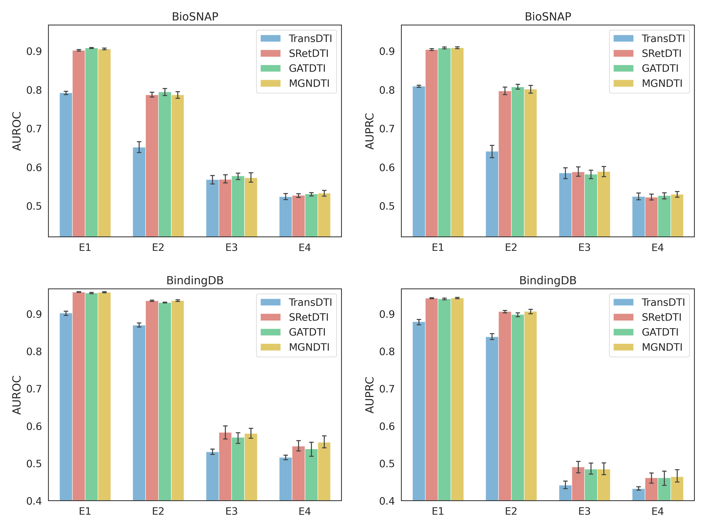
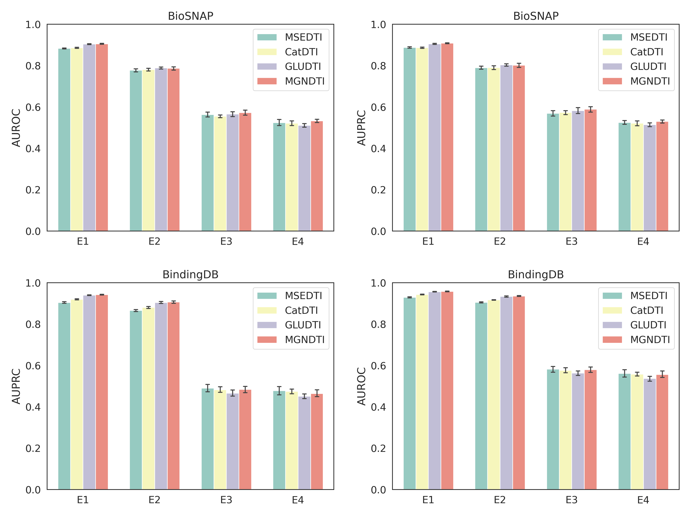

## Ablation experiments

### (1) Ablation experiments on ReNet and GCN under the BioSNAP and BindingDB datasets and four experimental setups.

### (2) Ablation experiments on multimodal representations under the BioSNAP and BindingDB datasets and four experimental setups.

### (3) Ablation experiments on multimodal gating network (MGN) under the BioSNAP and BindingDB datasets and four experimental setups.

